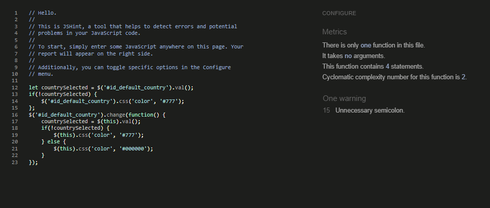

## TESTING.md

#### Nav Bar

Action | Expected outcome| Functional
-------|-----------------|----------|
Clicking The Logo | Redirect to HomePage | Yes
Clicking Profile Icon if logged in | Opens dropdown Menu | Yes
Clicking Bag icon | Redirect to My Bag | Yes
Clicking Log in button | Redirect to Log In page | Yes
Clicking Log Out Link if logged in | Redirect to Log Out page with options to log out or cancel | Yes
Clicking Register Link | Redirect to Register Page | Yes
Clicking Products Link | Options to start shopping the products avaliable | Yes
Clicking Vinyls Link | Options to start shopping Vinyls with sub categories or shop all links | Yes
Clicking the sub categories of each category | will be taken to just the products in the chosen category | Yes
When logged in as admin clicking the Product Management Button | Allow Admin to Add product | Yes

#### Home Page

Action | Expected outcome| Functional
-------|-----------------|----------|
Search Product that exists in db in search bar | Shows exactly the term searched | Yes
Clicking Shop Now Button | Direct to the Products page | Yes

#### Edit Term Page

Action | Expected outcome| Functional
-------|-----------------|----------|
Clicking edit button on product | redirected to edit product page | Yes
Complete Form and pressed submit button | redirected back to the product that was edited | Yes
Clicking cancel button in form | Redirect to Product page| Yes
User not filling in product name input field | Alert pop up "please fill in this field"| Yes
User not filling in product description input field | Alert pop up "please fill in this field"| Yes

#### Add Product

Action | Expected outcome| Functional
-------|-----------------|----------|
Clicking Product Management button | redirected to Add New Product form | Yes
Completely Filled in Form and pressed submit button | redirected to new products page | Yes
Clicking cancel button in form | Redirect to products page| Yes
User not filling in form details marked with '*' | Alert pop up "please fill in this field"| Yes

#### Register Page
Action | Expected outcome| Functional
-------|-----------------|----------|
If user is logged out or doesn't have an account clicking register in navbar | Redirect the user to Register Form | Yes
Not enough characters being used for username field | Alert pop up indicating what is wrong | Yes
Not enough characters being used for password field | Alert pop up indicating what is wrong | Yes
Typing in two different passwords | Form fail to submit and alert the user to what the issue is | Yes
User clicking register button after filling form out correctly | Redirects user to page asking them to verify the email address via the link that has been emailed to them | Yes
Verified email address through emailed link | Taken to login page | Yes

#### Log In Page

Action | Expected outcome| Functional
-------|-----------------|----------|
User clicks Log In link | Redirected to Log In Page | Yes
User fills out Invalid Credentials | Is met with a flash message that "Username and/or Password Is Incorrect" | Yes
User doesn't use enough characters in username field | Alert message indicates the mistake | Yes
User doesn't use enough characters in password field | Alert message indicates the mistake | Yes
User fills in form correctly and clicks Log In | User is redirected to User Profile Page and alerted they have been successfully logged in | Yes

#### Profile Page
Action | Expected outcome| Functional
-------|-----------------|----------|
User goes to Profile page | Can see their username and all terms they have added | Yes
User goes to Profile page | can see update information button | Yes
User changes the prefilled infomation form and presses update infomation button | Page reloads and alerts user thier infomation has been successfully changed | Yes
User can see any orders they have places | click on the order number and see their order details | Yes
When on the previous orders page click the back to profile button | Takes them back to the Profile page | Yes

#### Blog Page
Action | Expected outcome| Functional
-------|-----------------|----------|
User goes to Blog page | Can see all Blog Posts | Yes
User clicks on 'Read Full Post' | User is taken to the Post page | Yes
Author can edit post | Clicks on the edit button and taken to form | Yes
Author can delete post | clicks on delete button and modal appears | Yes

#### Blog Detail Page
Action | Expected outcome| Functional
-------|-----------------|----------|
Loads all data about clicked post | Can see image, title, author, date created on, full content of post | Yes
Can see any comments left by other users | Can see all commments made by other users | Yes
Logged in User Wants to add comment | Can easily locate 'Add Comment' button | Yes
Unregistered User wants to add comment | Is told they need to log in or register | Yes
Registered Users want to edit comment | Users can find the edit button and be taken to form | Yes
Registered Users want to remove comment | Users can find delete button and be met with a modal | Yes

#### Add Blog Post Page
Action | Expected outcome| Functional
-------|-----------------|----------|
Signed In User clicks Add Blog Post | Is taken to a Add Post form | Yes
Clicks Add Blog after filling in Form | Is taken to post that was just created | Yes
All required fields aren't filled in correctly | Message appears instructing users they need to fill in required area | Yes

#### Edit Blog Post Page
Action | Expected outcome| Functional
-------|-----------------|----------|
Author and Superuser click edit button | They are taken to the blogs form which they can edit | Yes
Correctly Fill out edited form | clicks submit button and are taken to the new updated post | Yes
Clicked cancel button when editing | Are taken back to all Blog Posts | Yes

### Automated Testing

#### All individual CSS files have been tested through [W3C CSS validator](https://jigsaw.w3.org/css-validator/).

#### base.css Test
 
#### profile.css Test
 
#### checkout.css Test
 

#### All individual JS files have been tested through [Jshint](https://jshint.com/).

#### Profiles JS Script Test
 

#### Checkouts JS Script Test
 

### Lighthouse Testing

#### Homepage Lighthouse
 
#### Product Lighthouse 
 
#### Individual Product Lighthouse
 
#### Add Product Lighthouse
 
#### Bag Lighthouse
 